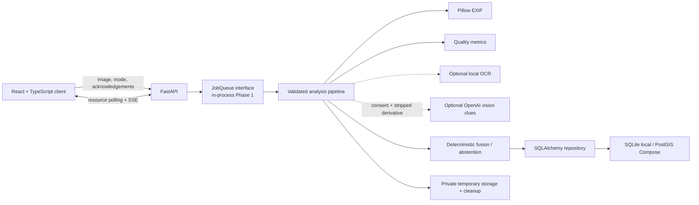

# AtlasLens

AtlasLens is a privacy-conscious photo analysis platform that reports defensible
geographic evidence, provenance, and uncertainty—and abstains when no reliable
signal exists.

The user-facing application preserves the Phase 1 upload-to-map API and frontend:
safe image validation, EXIF GPS, quality measurements, real job progress,
optional OCR, an optional consent-gated cloud vision provider, deterministic
candidate synthesis, bilingual UI, temporary persistence, and deletion. Phase 3
adds isolated offline retrieval; Phase 4 adds bounded candidate assessment; and
the in-progress Phase 5B adds evidence-driven OCR/place/retrieval/map seams without
replacing the existing API or frontend.

Phase 5C adds the bounded product shell needed while an external custom model
trains: canonical inference adapters, a production-refused watermarked development
simulation, strict local artifact registration/promotion, TTL-bound history,
read-only evaluation/dataset-QA catalogs, and investigation screens. It does not
replace GeoCLIP or Phase 5B, claim new accuracy, download model/data artifacts, or
start Phase 6. The bounded Phase 5C implementation and acceptance gates are
complete; Phase 5B's external accuracy-recovery gates remain blocked separately.

Phase 6A adds an optional local SegFormer-B2 scene-evidence provider and a bounded
hybrid candidate path. GeoCLIP generates an internal Top-50-style geographic set;
nearby points are clustered geodesically; optional OCR may support or contradict a
cluster; and optional offline reverse geocoding names coordinates without creating
or scoring them. Segmentation describes pixels only. All ranking and confidence
semantics remain explicitly uncalibrated, and the public candidate list remains
bounded for compatibility.

Phase 6B adds source-family-aware multi-model fusion without replacing that path.
GeoCLIP and SegFormer remain installed; real OSV-5M baseline, PLONK YFCC and
PaddleOCR inference now run through pinned loopback-only isolated workers.
RapidOCR has real-inference proof and a completed Paddle-disabled HTTP fallback.
Other PLONK variants are prepared-only and are not claimed ready. Optional OpenAI
hard-case review is disabled by default, requires request-level consent plus a
backend key/budget, and can only adjust supplied candidates or reject all. No
training dataset, retrieval corpus, calibration claim or Phase 6C work is included.

GeoCLIP 1.2.0 is the verified operational broad global predictor. The pinned
SigLIP2 implementation remains unavailable. RapidOCR 3.9.1 and ONNX Runtime 1.27.0
are installed and verified through the full fallback path, but no reviewed
10,000-image reference index exists, so Phase 5B is still **blocked** and no
combined-accuracy improvement is claimed. Scores remain uncalibrated.

## Product Phase 2 - Case and evidence workspace

Product Phase 2 adds a local case and evidence investigation workspace around
the unchanged single-analysis path. Authorized analysts can create cases, attach
multiple image-analysis records, review normalized evidence and location
hypotheses, append adjudications and separate operator corrections, and inspect a
tamper-evident application audit timeline.

The web application now includes Turkish case-list, case-creation and case-detail
views. A case upload still uses the existing validated `POST /api/v1/analyses`
flow; the UI then stores metadata, links the accepted analysis, and materializes
evidence and hypotheses only after completion. Repeated link and materialization
requests are idempotent, and the original analysis record is never rewritten.

Migration `0009` adds cases, case media, immutable evidence, location hypotheses,
append-only adjudications and hash-chained audit events. Operator corrections are
new hypotheses with positive uncertainty radii and their own adjudications; model
hypotheses remain visibly unverified until an analyst decision. Raw OCR text and
image bytes are not copied into the case tables.

Phase 2 deliberately uses one `local-default` workspace. It has no production
authentication, tenant isolation, collaboration, case-deletion workflow or
automatic enforcement of the recorded retention-policy label. Original image
availability continues to follow the existing temporary upload retention policy.
The audit chain is tamper-evident application history, not externally anchored or
legally certified evidence.

No new model, dataset, confidence calibration, ranking threshold, Türkiye
reference corpus, Phase 6C activation or cloud GPU infrastructure is part of this
phase. At the Phase 2 checkpoint, the next product step was Phase 3 planning only.

## Architecture



See [architecture](docs/architecture.md), [API](docs/api.md),
[privacy model](docs/privacy-model.md), and [threat model](docs/threat-model.md).
Phase 6A model preparation and exact Windows commands are in the
[hybrid-pipeline guide](docs/phase-6a-hybrid-pipeline.md). Phase 6B diagnostics,
weights-only preparation, smoke, evaluation and cloud cost controls are in the
[multi-model guide](docs/phase-6b-multimodel.md).

## Requirements

- Python 3.12.
- Node.js 24 and npm 11.
- `uv` 0.11 or compatible.
- Docker with Compose only for the containerized PostgreSQL/PostGIS stack.
- Optional isolated providers use CPython 3.10 for OSV-5M/PLONK and CPython 3.12
  for PaddleOCR. RapidOCR 3.9.1 + ONNX Runtime 1.27.0 use the API environment.
- Optional: an OpenAI API key for separately consented cloud clues.

No paid service or API key is required for the default local-only flow. On
Windows with a restricted PowerShell policy, use `npm.cmd` rather than `npm` and
invoke the provided scripts with `-ExecutionPolicy Bypass`.

## Quick start — Windows PowerShell

The active Windows checkout is `D:\geoSearch`. A relocatable runtime on C:
keeps locked application dependencies and caches off the constrained repository
drive:

```powershell
Set-Location D:\geoSearch
Copy-Item .env.example .env
New-Item -ItemType Directory -Force C:\AtlasLensRuntime | Out-Null
$env:UV_PROJECT_ENVIRONMENT = "C:\AtlasLensRuntime\api-venv"
$env:UV_CACHE_DIR = "C:\AtlasLensRuntime\uv-cache"
uv sync --project .\services\api --frozen --all-groups
npm.cmd --prefix .\apps\web ci --no-audit --no-fund --cache C:\AtlasLensRuntime\npm-cache
powershell -NoProfile -ExecutionPolicy Bypass -File .\scripts\dev.ps1 -RuntimeRoot C:\AtlasLensRuntime
```

The API runs at `http://127.0.0.1:8000` and the web UI at
`http://127.0.0.1:5173`. The launcher invokes the external Python by module,
adds the repository source directory without a personal hard-coded path, applies
the migration, waits for readiness/proxy identity, and keeps model/dataset
download guards enabled. Healthy workers and surfaces are reused. Ctrl+C cleans
up only processes started by that invocation; `-SmokeTest` exercises the same
cleanup path deterministically. Repository-local `services\api\.venv` remains
the fallback when `-RuntimeRoot` is omitted. To run surfaces in separate
terminals, use `scripts\start-api.ps1` and `scripts\start-web.ps1`. Docker is
not required; SQLite remains the local default.

## Quick start — Bash / Git Bash / Linux

```bash
cp .env.example .env
INSTALL_DEPS=1 bash scripts/dev.sh all
```

Use `bash scripts/dev.sh api`, `web`, or `dependencies` for an individual
surface. On this repository's inspected Windows host, call Git Bash explicitly
as `C:\Program Files\Git\bin\bash.exe`; the bare `bash` command may resolve to
an unconfigured WSL installation.

## Docker Compose

Copy `.env.example` to the untracked `.env` file and replace the example
`POSTGRES_PASSWORD` before starting:

```bash
docker compose up --build
```

The web app is exposed on `http://127.0.0.1:8080`, the API on port `8000`, and
PostgreSQL/PostGIS stays on an internal Compose network. Containers run without
root, drop Linux capabilities, use health checks, and keep temporary uploads in
a bounded tmpfs. Stop with `docker compose down`; add `--volumes` only when you
intentionally want to delete the local database volume.

## Analysis behavior

1. The browser validates the selected JPEG, PNG, or WebP and creates a local
   preview.
2. The server enforces the 20 MiB compressed limit, 40 MP decoded limit,
   signature/MIME/extension agreement, dimensions, single-frame decoding, and
   decompression-bomb controls.
3. It normalizes orientation, hashes the image, reads EXIF and real quality
   metrics, then invokes only configured and permitted optional providers.
4. Valid EXIF GPS creates an `exact_metadata` candidate with provenance and an
   uncertainty radius. The UI warns that metadata may be stale or altered.
5. A local-only image without geographic signal completes with an honest
   abstention. No runtime demo or random candidate is substituted.
6. The original temporary upload is removed in cleanup paths; the normalized
   safe result expires or can be deleted immediately.

### Local-only privacy boundary

Local-only means the image is processed by **your configured AtlasLens API
server** and no cloud analysis provider receives it. It does not mean the image
stays inside the browser. Do not expose the Phase 1 unauthenticated service to
the public internet.

### Optional cloud-assisted clues

Set `OPENAI_API_KEY` only in the server's untracked environment and optionally
change `OPENAI_VISION_MODEL`. The example model value follows the project
requirement and may require account access. Cloud invocation additionally
requires the user to select cloud mode and check explicit consent; a configured
key alone never enables a call. AtlasLens sends a normalized, downscaled,
metadata-stripped derivative through the OpenAI Responses API and requests
concise structured clues—not hidden reasoning, identity, or a private address.
Vision-only candidates remain unverified, have confidence at most `0.40`, and
use at least a `25 km` radius. Tests mock this provider and never make paid calls.

### Optional OCR

The Phase 5B default is `OCR_PROVIDER=rapidocr`. Install the exact Python runtime,
then explicitly receipt the wheel-bundled PP-OCRv6 models:

```powershell
cd services\api
# Install exact reviewed dependencies into this venv first; no startup download occurs.
.\.venv\Scripts\atlas.exe models install rapidocr
.\.venv\Scripts\atlas.exe models verify rapidocr
.\.venv\Scripts\atlas.exe gazetteer --json install-forward
```

Set `OCR_ENABLED=true` only after both verifications pass. The worker is lazy,
killable on timeout, supports CPU/CUDA selection, and redacts likely email,
telephone, identifier and plate values before persistence. Unredacted text is
ephemeral and never becomes an arbitrary network query. `OCR_PROVIDER=tesseract`
and `TESSERACT_CMD` preserve the older optional adapter.

## Phase 5B — Evidence-driven accuracy recovery (blocked)

The normal upload path can now combine source-specific GeoCLIP, OCR/GeoNames and
licensed FAISS retrieval hypotheses. `phase5b-v1` clusters within a bounded
geodesic radius, suppresses repeated provider/source/capture-family/content-hash
support, applies transparent weighted contributions and contradictions, and
retains honest abstention. Retrieval matches expose opaque reference IDs,
relative similarity, coordinates, license/attribution and display policy—never a
local dataset path or image blob.

The fixed evaluation has 30 reviewed Commons derivatives from 24 countries and
six inhabited continents. Its immutable fingerprint is
`9767b0ec500c0b7972aa0f26fdfb0d48560b908285c7c34cf23b18ae32b5fba9`.
GeoCLIP-only baseline country Top-1 is 19/28, Recall@200 km is 17/30, and median
error is 143.140 km. Combined metrics remain unavailable because the mandatory
real OCR/embedding/index gates have not run. See
[the accuracy plan](docs/phase-5b-accuracy-plan.md) and
[licensed reference runbook](docs/phase-5b-licensed-reference-runbook.md).

## Phase 3 — Offline visual retrieval

Phase 3 adds an isolated reference-image retrieval library and `atlas` admin
CLI. Retrieval asks “which licensed reference embeddings are nearest to this
embedding?” It does **not** assert that the photo was captured at a neighbor's
coordinates. Hits contain cosine distance, provider/version and reference
metadata; they are not candidates, confidence values, reranked results, or
geometric verification.

AtlasLens downloads no dataset or embedding model at startup. The real pinned
`siglip2-b16-384` provider implements explicit install/verify, deterministic
query/reference preprocessing, normalized 768-dimensional float32 embeddings,
CUDA/CPU selection and offline inference. It reports unavailable instead of
emitting demo/hash/random vectors until its verified snapshot is installed.

The local manifest must be UTF-8 CSV with this header:

```text
image_path,latitude,longitude,country,region,city,license,source,Notes
```

Paths resolve under an explicit input root. Every row is validated before any
mutation; source and license are required; coordinates must be finite WGS84;
country/region/city may be empty and are never inferred. `Notes` is validated
but not persisted. The metadata database stores no image blob, filename, or
source path.

```powershell
cd services\api
uv sync --frozen
uv run atlas embeddings create --manifest C:\licensed\manifest.csv --input-root C:\licensed\images --index-dir C:\atlas-index --provider siglip2
uv run atlas embeddings verify --index-dir C:\atlas-index
uv run atlas embeddings info --index-dir C:\atlas-index
uv run atlas embeddings remove --index-dir C:\atlas-index --yes
```

`create` currently exits safely with an unavailable-provider explanation and
does not create a misleading index. `verify` checks FAISS checksum/spec/IDs and
metadata consistency. `remove` requires `--yes` and refuses directories that
are not marked as AtlasLens retrieval indexes. See
[the Phase 3 plan](docs/phase-3-implementation-plan.md) and
[dataset/license matrix](docs/license-register.md).

### Product Phase 3B2 - Offline MegaLoc and first-party capture

The existing Phase 3B1 corpus/index pipeline now has a repository-native offline
MegaLoc descriptor adapter and six rights-aware capture commands:
`inspect-capture`, `sync-gpx`, `sample-route`, `import-capture`,
`privacy-review`, and `build-capture-manifest`. Phone/dashcam frames can use
timezone-aware EXIF GPS, bounded GPX/CSV synchronization, or explicit video
metadata. Sampling is distance-based (25/50/100 metres, default 50), and pending,
rejected, needs-redaction or revoked media cannot enter the Phase 3B1 manifest.

The local MegaLoc artifact passed one real offline CUDA technical smoke, but the
separate source/weight/production approval flags remain false. Therefore the
production registry and Türkiye API capability stay fail-closed `not_ready` and
disabled by default. No real capture, model/dataset download, cloud resource, or
accuracy evaluation is part of this checkpoint. See the
[Phase 3B2 operator runbook](docs/phase3b2/operator-runbook.md).

### Product Phase 3B3 - Private Mapillary Türkiye demo

Phase 3B3 adds a disabled-by-default, loopback-only private technical demo over a
small attributed Mapillary partition. The official Graph API coverage audit chose
Ankara after Kayseri failed the 1,000-image preference gate. The bounded pilot
acquired 81 1024-pixel renditions, locked 29 references plus 11 holdout queries,
and built a real 8,448-dimensional MegaLoc `IndexFlatIP` bundle. Mapillary media,
descriptors, index files and receipts remain outside Git.

This pilot is not a Türkiye-wide or calibrated geolocation system. Its 11-query
holdout produced 45.45% Recall@1 at 1 km, 7.12 km median error and 10.38 km p90
error; no calibrated abstention threshold exists. Results expose rank, raw cosine
similarity/distance, positive presentation uncertainty, stable source attribution
and CC-BY-SA notice, never fabricated confidence. Public/production/commercial
activation, Phase 6C and cloud infrastructure remain disabled. See the
[Phase 3B3 private-demo runbook](docs/phase3b3/operator-runbook.md).

## Phase 5C - Product workflows and custom-model handoff

The safe default remains production mode with simulation and the unauthenticated
operator report API disabled. For a trusted local UI-development session only:

```text
APP_ENV=development
ENABLE_MOCK_INFERENCE=true
MOCK_SCENARIO=development_demo
MOCK_INFERENCE_MODE=primary
```

Every such result is classified `simulated` and visibly watermarked. Production
startup refuses the mock. Simulated providers/reports are excluded from evaluation
and must never support an accuracy claim.

History uses existing TTL-bound result records and exposes safe summaries. Rerun
requires an explicitly retained `local_only` source (`KEEP_UPLOADS=true`); it
creates a new analysis. Cloud-assisted rerun requires a new upload and consent.
Provider status is safe and read-only. Models, evaluation reports and dataset-QA
reports are exposed only when `APP_ENV=development`/`test` and
`OPERATOR_API_ENABLED=true`; production configuration refuses that unauthenticated
operator surface.

An already-exported custom ONNX model can be prepared, registered, verified and
tested without changing GeoCLIP:

```powershell
services\api\.venv\Scripts\python.exe scripts\prepare-custom-model-manifest.py --help
cd services\api
.\.venv\Scripts\atlas.exe models register-local --manifest C:\private\model\manifest.yaml
.\.venv\Scripts\atlas.exe models verify atlaslens-custom-geolocation
.\.venv\Scripts\atlas.exe models info atlaslens-custom-geolocation
.\.venv\Scripts\atlas.exe models test atlaslens-custom-geolocation --image C:\licensed\smoke.jpg --device cpu
```

Verification enters shadow mode. Promotion is an explicit fail-closed CLI action
using a paired evaluation report; raw model scores remain uncalibrated. See the
[custom-model handoff](docs/custom-model-handoff.md),
[dataset-QA guide](docs/dataset-qa.md),
[evaluation dashboard guide](docs/evaluation-dashboard.md), and
[Windows runbook](docs/windows-runbook.md).

## Phase 6A - Hybrid evidence and SegFormer-B2

The trusted `last_checkpoint.pt` is inspected on CPU and converted once into an
ignored safe-serialized deployment directory. The current checkpoint selects EMA
weights, uses SegFormer-B2 with 124 classifier outputs, and records its exact hash
and training metadata. The reviewed exact 124-entry Mapillary mapping is restored
from the repository configuration without modifying safetensors; semantic names
and centralized scene groups are available, while segmentation remains descriptive
and has zero direct geographic weight.

```powershell
.\services\api\.venv\Scripts\python.exe .\scripts\inspect_segmentation_checkpoint.py .\last_checkpoint.pt
.\services\api\.venv\Scripts\python.exe .\scripts\prepare_segmentation_model.py .\last_checkpoint.pt --base-model-dir .\.local\models\base-segformer-b2-cityscapes --output .\.local\models\atlaslens-segformer-b2-v4
.\services\api\.venv\Scripts\python.exe .\scripts\restore_mapillary_labels.py
```

Enable the prepared provider only in the untracked `.env`:

```text
PHASE6A_ENABLED=true
GEOCLIP_INTERNAL_TOP_K=50
SEGMENTATION_ENABLED=true
SEGMENTATION_MODEL_DIR=.local/models/atlaslens-segformer-b2-v4
SEGMENTATION_DEVICE=auto
```

The API additions are optional and backward compatible: analysis-level scene
summary; per-candidate GeoCLIP cluster, offline reverse label, qualitative
uncalibrated confidence, and explainable `phase6a-v1` ranking diagnostics. The
frontend omits absent provider data and warns that scene evidence is not
geographic evidence. See the [Phase 6A guide](docs/phase-6a-hybrid-pipeline.md)
before staging the official base model or enabling the provider.

## Phase 6B - Multi-model ensemble

Phase 6B fields are optional and backward compatible: provider results, explainable
`phase6b-v1` fusion, OCR summary and cloud-assist status. Raw model scores are
never averaged; OSV-5M and PLONK-OSV share one source family; at least two
independent families are required before a fused batch can replace the preserved
candidate result. Confidence stays uncalibrated.

Verify the installed host without downloading anything, then run a licensed local
smoke image:

```powershell
powershell -NoProfile -ExecutionPolicy Bypass -File .\scripts\bootstrap_phase6b_models.ps1 -VerifyOnly
powershell -NoProfile -ExecutionPolicy Bypass -File .\scripts\start-phase6b-workers.ps1
.\services\api\.venv\Scripts\atlas.exe diagnostics phase6b --json
powershell -NoProfile -ExecutionPolicy Bypass -File .\scripts\smoke_phase6b.ps1 -Image C:\licensed\smoke.jpg
powershell -NoProfile -ExecutionPolicy Bypass -File .\scripts\stop-phase6b-workers.ps1
```

The worker manager verifies one real offline load/inference by default; it refuses
foreign listeners on ports 8791-8793. `model_loaded=false` after verification may
mean the model was unloaded, while retained `load_verified=true` and
`inference_verified=true` are required for `ready`. The exact provider states are
`not_installed`, `dependencies_installed`, `weights_prepared`,
`worker_unreachable`, `model_load_failed`, `inference_not_verified`, `ready`, and
`disabled`.

The project uses pretrained model weights only. No training dataset is required
for Phase 6B inference. See the [Phase 6B guide](docs/phase-6b-multimodel.md) before
running a network bootstrap or the separately consented/billable OpenAI smoke.

## Phase 6C - Bounded Türkiye reference acquisition

The reference-corpus command first writes an offline plan covering all 81
provinces and prints its count/storage estimate. It makes no network request
unless both `--execute` and `--confirm-download` are present. Mapillary remains
disabled without a backend-only token in the untracked repository-root `.env`;
KartaView is a secondary source with a separate exact terms-version acceptance.

```powershell
.\services\api\.venv\Scripts\python.exe .\scripts\acquire_turkiye_references.py
.\services\api\.venv\Scripts\atlas.exe gazetteer verify
.\services\api\.venv\Scripts\python.exe .\scripts\acquire_turkiye_references.py --execute --confirm-download
```

The output `reference-input.json` is accepted directly by the leakage audit and
is the exact input contract consumed by `scripts/build_turkey_reference_index.py`
(a compatibility entrypoint for the MegaLoc builder). Missing province coverage
remains an explicit partial result. If the audit excludes a record, the runbook's
explicit filtered-copy-and-rerun flow preserves the original manifest and image
files; the initial failed audit never becomes a pass. See the
[Phase 6C reference-corpus runbook](docs/phase6c-reference-corpus.md) before
enabling either remote source.

## Configuration

All supported variables and safe examples are in `.env.example`.

| Area | Variables |
|---|---|
| API | `API_HOST`, `API_PORT`, `APP_VERSION`, `ALLOWED_ORIGINS`, `LOG_LEVEL` |
| Database | `DATABASE_URL`, `POSTGRES_DB`, `POSTGRES_USER`, `POSTGRES_PASSWORD` |
| Uploads | `MAX_UPLOAD_BYTES`, `MAX_DECODED_PIXELS`, `MAX_IMAGE_DIMENSION`, `TEMP_STORAGE_DIR` |
| Retention | `RETENTION_TTL_SECONDS`, `KEEP_UPLOADS` |
| Providers | `OCR_ENABLED`, `OCR_PROVIDER`, `RAPIDOCR_DEVICE`, `RAPIDOCR_TIMEOUT_SECONDS`, `TESSERACT_CMD`, `OPENAI_API_KEY`, `GLOBAL_MODEL_ENABLED`, `GLOBAL_MODEL_DEVICE`, `CUSTOM_MODEL_ENABLED`, `CUSTOM_MODEL_ID`, `CUSTOM_MODEL_DEVICE`, `PHASE5B_ENABLED`, `RETRIEVAL_ENABLED`, `RETRIEVAL_EMBEDDING_PROVIDER`, `RETRIEVAL_DEVICE`, `RETRIEVAL_TOP_K`, `MAP_EVIDENCE_ENABLED`, `OVERPASS_USER_AGENT` |
| Phase 6A hybrid evidence | `PHASE6A_ENABLED`, `GEOCLIP_INTERNAL_TOP_K`, `GEOCLIP_CLUSTER_RADIUS_KM`, `SEGMENTATION_ENABLED`, `SEGMENTATION_CHECKPOINT`, `SEGMENTATION_MODEL_DIR`, `SEGMENTATION_DEVICE`, `SEGMENTATION_MIN_CLASS_RATIO`, `SEGMENTATION_MAX_DOMINANT_CLASSES`, `SEGMENTATION_TIMEOUT_SECONDS`, `REVERSE_GEOCODE_TOP_K`, `REVERSE_GEOCODE_TIMEOUT_SECONDS` |
| Phase 6B ensemble | `PHASE6B_ENABLED`, `OSV5M_ENABLED`, `OSV5M_WORKER_ENABLED`, `OSV5M_WORKER_HOST`, `OSV5M_WORKER_PORT`, `OSV5M_MODEL_ID`, `OSV5M_MODEL_REVISION`, `OSV5M_DEVICE`, `OSV5M_TIMEOUT_SECONDS`, `PLONK_ENABLED`, `PLONK_WORKER_ENABLED`, `PLONK_WORKER_HOST`, `PLONK_WORKER_PORT`, `PLONK_OSV_MODEL_ID`, `PLONK_YFCC_MODEL_ID`, `PLONK_INAT_MODEL_ID`, `PLONK_DEVICE`, `PLONK_SAMPLE_COUNT`, `PLONK_TIMEOUT_SECONDS`, `PADDLEOCR_ENABLED`, `PADDLEOCR_WORKER_ENABLED`, `PADDLEOCR_WORKER_HOST`, `PADDLEOCR_WORKER_PORT`, `PADDLEOCR_DEVICE`, `PADDLEOCR_TIMEOUT_SECONDS`, `PADDLEOCR_FALLBACK_TO_RAPIDOCR`, `PHASE6B_WORKER_STARTUP_TIMEOUT_SECONDS`, `GPU_MAX_HEAVY_CONCURRENCY`, `GPU_MAX_RESIDENT_MODELS` |
| Phase 6C recall/retrieval | `PHASE6C_ENABLED`, `PHASE6C_PIPELINE_VERSION`, `PHASE6C_FUSION_CONFIG`, `PHASE6C_OCR_CONFIG`, `GEOCLIP_HIERARCHICAL_ENABLED`, `GEOCLIP_GLOBAL_GRID_ENABLED`, `GEOCLIP_TURKIYE_REFINEMENT_ENABLED`, `GEOCLIP_GRID_POINTS`, `GEOCLIP_GRID_MAX_CANDIDATES`, `GEOCLIP_GRID_REFINEMENT_LEVELS_KM`, `MEGALOC_ENABLED`, `MEGALOC_WORKER_ENABLED`, `MEGALOC_WORKER_HOST`, `MEGALOC_WORKER_PORT`, `MEGALOC_DEVICE`, `MEGALOC_TIMEOUT_SECONDS`, `MEGALOC_TOP_K`, `REFERENCE_INDEX_ENABLED`, `REFERENCE_INDEX_PATH`, `REFERENCE_INDEX_MAX_IMAGES`, `REFERENCE_INDEX_MAX_DISK_GB`, `REFERENCE_INDEX_MAX_PER_PROVINCE`, `REFERENCE_INDEX_MAX_PER_SEQUENCE`, `G3_ENABLED`, `G3_DEVICE`, `G3_MAX_CANDIDATES`, `G3_TIMEOUT_SECONDS`, `GEOLOCATION_IMPROVEMENT_MAX_ITERATIONS` |
| Phase 6C reference acquisition | `MAPILLARY_ENABLED`, `MAPILLARY_ACCESS_TOKEN`, `MAPILLARY_MAX_IMAGES`, `MAPILLARY_IMAGE_WIDTH`, `KARTAVIEW_ENABLED`, `KARTAVIEW_MAX_IMAGES` |
| Product Phase 3B2 pilot (disabled) | `MEGALOC_PHASE3B2_CONFIG_PATH`, `TURKIYE_REFERENCE_INDEX_ENABLED`, `TURKIYE_REFERENCE_INDEX_PATH`, `TURKIYE_REFERENCE_SOURCE_POLICY_PATH`, `TURKIYE_REFERENCE_DESCRIPTOR_ID`, `TURKIYE_REFERENCE_DESCRIPTOR_VERSION`, `TURKIYE_REFERENCE_DESCRIPTOR_DIMENSION`, `TURKIYE_REFERENCE_DESCRIPTOR_ARTIFACT_SHA256`, `TURKIYE_REFERENCE_DESCRIPTOR_PREPROCESSING_VERSION` |
| Product Phase 3B3 private demo (disabled) | `ATLASLENS_TURKIYE_DEMO_ENABLED`, `ATLASLENS_TURKIYE_DEMO_BUNDLE_PATH`, `ATLASLENS_TURKIYE_DEMO_EXPECTED_PUBLICATION_SHA256`, `ATLASLENS_TURKIYE_DEMO_EXPECTED_SOURCE_POLICY_SHA256`, `ATLASLENS_TURKIYE_DEMO_EXPECTED_SELECTION_LOCK_SHA256`, `ATLASLENS_TURKIYE_DEMO_TOP_K`, `ATLASLENS_TURKIYE_DEMO_UNCERTAINTY_RADIUS_M` |
| Phase 6B cloud review | `OPENAI_GEO_ENABLED`, `OPENAI_GEO_MODEL`, `OPENAI_GEO_REASONING_EFFORT`, `OPENAI_GEO_IMAGE_DETAIL`, `OPENAI_GEO_MAX_OUTPUT_TOKENS`, `OPENAI_GEO_MONTHLY_BUDGET_USD`, `OPENAI_GEO_DAILY_CALL_LIMIT`, `OPENAI_GEO_PER_ANALYSIS_CALL_LIMIT`, `OPENAI_GEO_ALLOW_HIGH_DETAIL_RETRY`, `OPENAI_GEO_CACHE_TTL_DAYS` |
| Phase 5C development/operator | `APP_ENV`, `ENABLE_MOCK_INFERENCE`, `MOCK_SCENARIO`, `MOCK_INFERENCE_MODE`, `OPERATOR_API_ENABLED`, `EVALUATION_REPORT_DIR`, `DATASET_QA_REPORT_DIR`, `VITE_ENABLE_OPERATOR_UI` |
| Local artifacts | `MODEL_CACHE_DIR`, `RAPIDOCR_MODEL_ROOT`, `GAZETTEER_CACHE_DIR`, `RETRIEVAL_INDEX_DIR` |
| Abuse/SSE | `ANALYSIS_RATE_LIMIT_PER_MINUTE`, `CLOUD_RATE_LIMIT_PER_MINUTE`, `MAX_QUEUED_JOBS`, `MAX_SSE_CONNECTIONS_PER_CLIENT`, `SSE_HEARTBEAT_SECONDS`, `MAX_SSE_LIFETIME_SECONDS` |
| Web/map | `VITE_API_BASE_URL`, `VITE_DEV_API_TARGET`, `VITE_MAP_PROVIDER`, `VITE_MAP_STYLE_URL`, `WEB_PORT` |

Leave `VITE_MAP_STYLE_URL` empty for the documented OpenFreeMap Positron
development default. It is not a production SLA.
Production deployments must choose a map/tile provider whose license, privacy
terms, capacity, attribution, and availability fit expected use; map requests
may reveal the viewer's IP and viewed region.

## Verification

Full Windows orchestration:

```powershell
# Restore from the frozen locks and run every check:
powershell -NoProfile -ExecutionPolicy Bypass -File .\scripts\test.ps1 -RuntimeRoot C:\AtlasLensRuntime

# Reuse an already restored runtime; record Docker as an environmental blocker:
powershell -NoProfile -ExecutionPolicy Bypass -File .\scripts\test.ps1 -RuntimeRoot C:\AtlasLensRuntime -SkipInstall -SkipDockerValidation
```

Full Bash orchestration:

```bash
bash scripts/test.sh
```

Both run locked installs, backend Ruff/mypy/pytest, frontend ESLint/TypeScript/
Vitest/build, generated OpenAPI drift, Playwright when configured, contract
parsing, and Compose validation. When Docker is genuinely unavailable, use
`-SkipDockerValidation` or `SKIP_DOCKER_VALIDATION=1` only while recording that
exact environmental blocker. Individual commands are documented in each
application README and CI workflow.


### Phase 1 repository-safety checkpoint (2026-07-15)

The source-only pre-change backup is
`C:\AtlasLensBackups\AtlasLens-source-prechange-20260715-171223.zip`
(1,335,612 bytes; embedded SHA-256 manifest verified 483/483). The sanitized
baseline exists as `c2bfc22` (`chore: establish sanitized AtlasLens baseline`),
followed by the relocatable runtime commit `6410bf4` (`build: restore relocatable
Windows development runtime`). Repository-local Git author identity is
configured; global Git configuration was not modified. No remote repository is
configured, and no push or pull request has occurred. Models, datasets, runtime
environments, caches, databases and user media remain outside Git.

Phase 1 safety and runtime restoration remain complete. The separately authorized
Product Phase 2 case workspace is complete at migration `0009`. Phase 6C remains
disabled by default, and cloud GPU infrastructure has not been provisioned. The
next product step at that checkpoint was Phase 3 planning. **READY FOR PLANNING**
does not authorize cloud provisioning.
The real `.env` was neither read nor printed.

USER ACTION REQUIRED — external credential revocation cannot be verified locally.

## Troubleshooting

- `npm.ps1 cannot be loaded`: run `npm.cmd`, or use the supplied PowerShell
  scripts with `-ExecutionPolicy Bypass`.
- `docker was not found`: local SQLite development still works; Compose
  validation/PostGIS requires Docker installation.
- OCR unavailable: verify `atlas models info rapidocr`, the pinned runtime and
  `atlas gazetteer --json info-forward`; or select the legacy Tesseract adapter.
- Cloud capability unavailable: set the key on the API server, not in the
  browser; absence must not affect local readiness.
- Empty map background: inspect the visible style error and configure a reachable,
  reviewed `VITE_MAP_STYLE_URL`; production must not rely on a public demo style.
- Jobs vanish after restart: the Phase 1 in-process queue is intentionally
  non-durable; distributed execution remains deferred to Phase 6.

## Privacy and safety warning

Images and metadata can expose precise location and personal text. Analyze only
images you own or are authorized to use. Estimates and metadata can be wrong;
uncertainty circles are not guaranteed boundaries. Deletion cannot recall an
already-sent cloud request or guarantee forensic erasure outside the application's
known storage. Review [the privacy model](docs/privacy-model.md) before deployment.

## Phase 4 — Candidate assessment

Phase 4 adds bounded geodesic clustering, deterministic `phase4-v1` reranking,
optional map constraints, opaque licensed-reference resolution, and a real CPU
OpenCV ORB/homography baseline. It does not activate a production embedding model,
download a dataset, or claim calibrated accuracy. Retrieval neighbors remain inputs;
geometry means visual consistency with a reference, not proof of location.

Existing analyses continue unchanged. When a provider supplies a Phase 4 assessment,
the candidate card adds English/Turkish diagnostics for the decimal relative score,
breakdown, diversity, map/geometry observations, contradictions, attribution, display
policy, and limitations. Map constraints are disabled by default and tests are
offline. Reference paths, blobs and descriptors never enter API results. See
[the Phase 4 plan](docs/phase-4-implementation-plan.md).

## Phase 5 — Operational global prediction

Phase 5 implements an explicitly installed local GeoCLIP provider for broad
Top-K global hypotheses. It is distinct from Phase 3 reference retrieval:
GeoCLIP compares an image embedding with a fixed GPS gallery and proposes broad
coordinates; retrieval returns similar licensed reference images; Phase 4 map
and geometry stages can add support or contradictions but do not turn either
input into geographic proof.

The API never downloads a model during startup, readiness, capabilities, or an
analysis. Installation is an operator action and artifacts remain outside Git.
After verified installation, runtime forces offline Hugging Face/Transformers
behavior, loads the pinned CLIP snapshot locally, and invokes the provider during
normal `local_only` analysis without an OpenAI key.

```powershell
cd services\api
uv sync --frozen
uv run atlas models list
uv run atlas models install geoclip
uv run atlas models verify geoclip
uv run atlas models info geoclip
uv run atlas models test geoclip --image C:\licensed\photo.jpg --device auto
uv run atlas models benchmark geoclip --image C:\licensed\photo.jpg --runs 5 --device auto
```

The guarded setup script also requires an operator-supplied licensed smoke image:

```powershell
powershell -ExecutionPolicy Bypass -File scripts\setup-models.ps1 -SmokeImage C:\licensed\photo.jpg
```

The default CLI and API cache resolve to the same private per-user AtlasLens
directory. For a custom location, set API `MODEL_CACHE_DIR` and pass the identical
path as `atlas models --cache-root <path> ...`; do not place the cache in Git.

The benchmark command above reports local diagnostic timing only; no timing is a
product performance claim. On the verified Windows host, CUDA, CPU, network-disabled
restart, real EXIF-free API/browser Top-K, and six-image acceptance all passed. These
host results must be reproduced on other deployments rather than inferred from unit
tests.

GeoCLIP's fixed-gallery softmax is stored as
`uncalibrated_gallery_softmax`, not probability or accuracy. Model-only
candidate confidence is `null`; the initial radius is at least `750 km` and may
be widened by Top-K dispersion. EXIF remains a separate metadata source. Model
failure, absence, honest low-information abstention, retrieval, map support, and
geometry support remain separate states in API and UI diagnostics.

### Offline place labels

GeoNames `cities15000`, `countryInfo.txt`, and `admin1CodesASCII.txt` can be
installed explicitly from the official HTTPS dump. The manager builds a
read-only local SQLite gazetteer, records downloaded artifact hashes and sizes,
and retains `GeoNames` attribution under CC BY 4.0.

```powershell
uv run atlas gazetteer install
uv run atlas gazetteer verify
uv run atlas gazetteer info
uv run atlas gazetteer remove --yes
```

For a custom gazetteer location, set API `GAZETTEER_CACHE_DIR` and pass the same
path as `atlas gazetteer --cache-root <path> ...`.

Detailed labels are optional; coordinate-only output is the honest fallback.

### Evaluation and calibration

Evaluation is manifest-driven and separate from uploads. It validates an
explicit asset root, WGS84 truth, source/license/attribution, SHA-256, split,
capture family, a recomputed perceptual hash with cross-split near-duplicate
rejection, and geographic distribution.
Every accepted license must be allowlisted by the operator.

The explicit six-continent Wikimedia Commons smoke recipe downloads only reviewed
1,280 px derivatives into the ignored `.local` directory. It fails closed if the
official API no longer supplies the reviewed camera coordinates, creator/credit,
license URL, or attribution requirement. It is a small biased benchmark slice,
not training data and not sufficient for calibration.

```powershell
services\api\.venv\Scripts\python.exe scripts\acquire-phase5-evaluation.py
cd services\api
uv run atlas benchmark validate --manifest ..\..\.local\evaluation\manifest.csv --asset-root ..\..\.local\acceptance-images --allow-license CC0-1.0 --allow-license CC-BY-4.0 --allow-license CC-BY-SA-4.0
uv run atlas benchmark run --manifest ..\..\.local\evaluation\manifest.csv --asset-root ..\..\.local\acceptance-images --allow-license CC0-1.0 --allow-license CC-BY-4.0 --allow-license CC-BY-SA-4.0 --provider geoclip --gazetteer-cache ..\..\.local\gazetteer --output ..\..\.local\benchmark-results --split test

uv run atlas benchmark validate --manifest C:\eval\manifest.csv --asset-root C:\eval\images --allow-license CC0-1.0
uv run atlas benchmark run --manifest C:\eval\manifest.csv --asset-root C:\eval\images --allow-license CC0-1.0 --provider geoclip --output C:\eval\report --split test
uv run atlas benchmark report --output C:\eval\report
uv run atlas benchmark info --output C:\eval\report
uv run atlas acceptance run --directory C:\eval\acceptance --provider geoclip --output C:\eval\acceptance-report --device auto
```

After a verified custom artifact and ONNX Runtime are present, run the custom
provider on that same held-out manifest and compare the independent reports:

```powershell
uv run atlas benchmark run --manifest C:\eval\manifest.csv --asset-root C:\eval\images --allow-license CC0-1.0 --provider atlaslens-custom-geolocation --custom-model-id atlaslens-custom-geolocation --device cuda --output C:\eval\custom-report --split test
uv run atlas benchmark compare --providers geoclip,atlaslens-custom-geolocation --manifest C:\eval\manifest.csv --asset-root C:\eval\images --allow-license CC0-1.0 --geoclip-report C:\eval\report --custom-report C:\eval\custom-report --output C:\eval\comparison --split test
```

`atlas acceptance run` is a direct-provider smoke acceptance. Its report explicitly
does not claim to have exercised FastAPI, the frontend, restart, or network-disabled
execution; those product gates require the separate real Playwright/API run.

Reports are JSON, per-image CSV and Markdown with explicit denominators and
exclusions. No evaluation image or valid calibration artifact is bundled; the
reviewed recipe requires an explicit local acquisition command. The current
six-image smoke result is preliminary and landmark-heavy, so it does not promote
calibration or support a production accuracy claim. Preliminary calibration never
becomes display confidence, and artifacts must match provider/model revision,
feature schema, split fingerprints/counts, class support and promotion metrics.

OSV-5M and SigLIP2 are not Phase 5 fallbacks. Phase 6B later explicitly prepared
and activated only the pinned OSV-5M baseline worker; it did not acquire the
OSV-5M dataset. SigLIP2 remains unavailable, and neither provider is silently
enabled or downloaded during startup/request handling.

## Project memory and roadmap

Read `PROJECT_STATE.md` before extending the system. The roadmap contains
[exactly six phases](docs/roadmap.md); future work must remain assigned to one of
them. Runtime and service review status is tracked in
`docs/license-register.md`.
