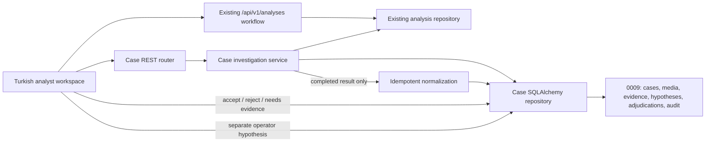
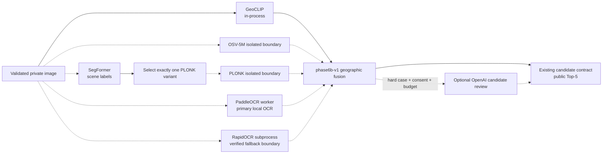
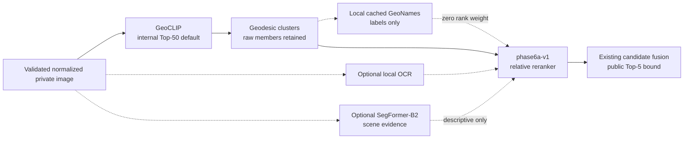
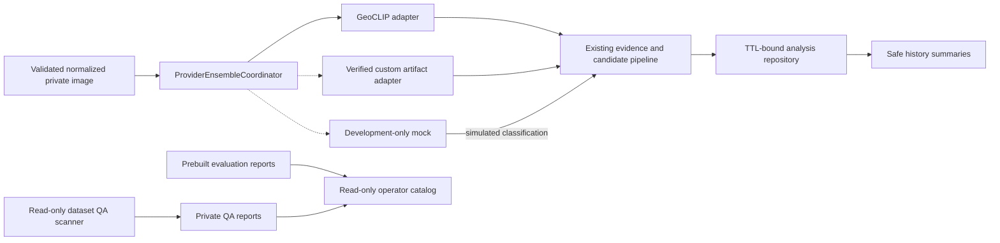
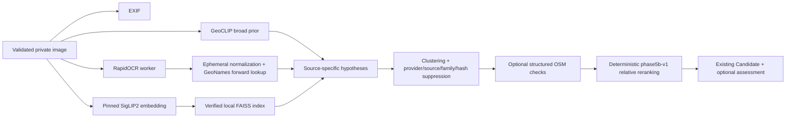
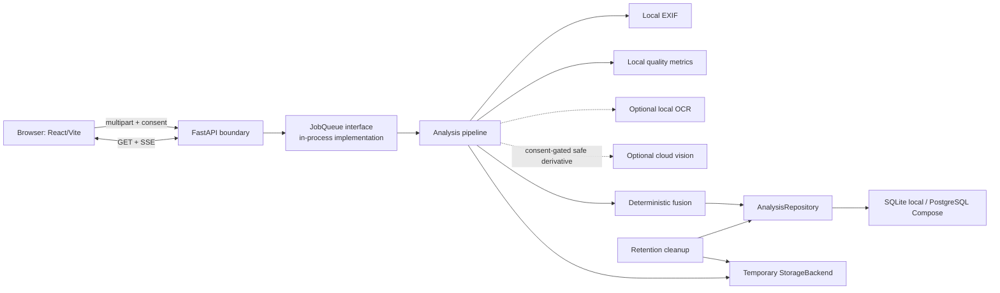
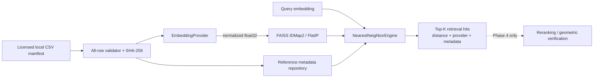
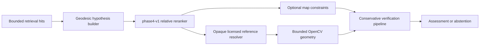
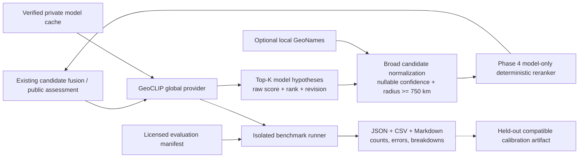

# AtlasLens architecture

## Product Phase 2 case and evidence workspace

Product Phase 2 is an additive investigation layer around the preserved analysis
pipeline. The browser still submits image bytes only to the existing validated
analysis endpoint. After acceptance it creates case-media metadata, links the
analysis UUID, polls the existing resource, and asks the case service to
materialize a completed result. Materialization reads the persisted analysis and
never reruns providers or mutates original model output.

The case router exposes 14 operations over 11 `/api/v1/cases` paths. Service and
repository calls always include the fixed `local-default` workspace identifier;
this is an integration seam, not production tenancy. Actor IDs are local
application metadata rather than authenticated principals. Production identity,
authorization and cross-tenant policy remain future work.

Revision `0009` adds six tables without altering `analyses`. Evidence,
hypotheses, adjudications and audit events have no update/delete API. SQLite and
PostgreSQL receive update/delete rejection triggers for those tables. Audit events
are appended in the same transaction as each case action with monotonic sequence,
canonical JSON, previous hash and SHA-256 event hash. Repository serialization
supports the single-process local topology; multi-process coordination is not
claimed. Database administrators can still replace the database, triggers or
application, and the chain has no external timestamp.

Case media is metadata only. Its content hash must match the linked completed
analysis before materialization; original bytes continue through existing
temporary storage and cleanup. Normalization projects only bounded safe evidence,
redacts OCR display text, preserves provider provenance and calibration state,
and requires a positive uncertainty radius. Retrieval remains supporting evidence,
not a confirmed location. Operator corrections create a new hypothesis and
adjudication instead of overwriting a model hypothesis.

This product layer does not change provider execution, fusion, candidate ranking,
confidence thresholds or geolocation behavior. Phase 6C serving remains disabled
by default; no Türkiye corpus, new model, dataset or cloud runtime is introduced.

## Phase 6B multi-model extension

Phase 6B adds typed, optional geographic-provider results around the preserved
GeoCLIP path. OSV-5M and exactly one scene-routed PLONK specialization may add
coordinates when their isolated workers are operational; unavailable workers
remain explicit neutral outcomes. PaddleOCR or the existing reviewed RapidOCR
fallback may add only normalized place evidence. No provider can erase a valid
Phase 6A result merely by being absent.

The activated single-host topology keeps the API's Python 3.12/CUDA environment
unchanged: OSV-5M baseline and PLONK YFCC run in separate Python 3.10 CPU workers,
and PaddleOCR runs in a Python 3.12 CPU worker. RapidOCR retains its killable
API-side subprocess boundary. Loopback HTTP is protocol-, provider-, revision-,
size- and timeout-checked. The worker manager refuses foreign port owners and
persists private PID identity; no worker address, executable path or artifact path
is returned through the public API.

The preferred OCR boundary was accepted in both directions: PaddleOCR completed
the primary full pipeline, and a separate Paddle-worker-disabled HTTP analysis
completed and persisted with RapidOCR, `fallback_used=true` and real detections.
RapidOCR request enablement is independent of Paddle worker enablement, and its
configured device must match its hash-bound verified runtime receipt.

`GeographicProviderResult` owns provider identity, model/source revision, source
family, device, duration, score semantics, bounded candidates and an explicit
completed/skipped/disabled/failed/timeout state. Native outputs are normalized at
the adapter boundary. The default scheduler allows one heavy call and one resident
model; timeouts, cancellation and CUDA OOM return safe outcomes and release the
slot.

Runtime readiness is evidence-based, not directory-based. The state progression is
`not_installed` -> `dependencies_installed` -> `weights_prepared` -> live worker
states (`worker_unreachable`, `model_load_failed`, `inference_not_verified`) ->
`ready`, with `disabled` orthogonal. `ready` requires import, weight, real-load and
real-inference proof from an identity-matched process. A worker may unload after
verification, so current `model_loaded=false` is compatible with retained
`load_verified=true` and `inference_verified=true`.

`phase6b-v1` never averages raw scores. It uses within-provider rank, geodesic
agreement, sample density, provider diversity, independent-family agreement,
bounded same-family support, OCR agreement/contradiction and dispersion. OSV-5M
and PLONK-OSV share `osv5m_family`, so correlated support is not counted twice as
independent evidence. Contributions remain explicit and uncalibrated. The new
analysis fields (`model_predictions`, `fusion`, `ocr`, `cloud_assist`) are optional,
and migration `0007` stores only bounded JSON summaries plus a private cloud-cache
key; old rows remain readable.

The optional OpenAI reviewer receives one 768-pixel metadata-free derivative and
candidate IDs/descriptions without exact coordinates in the prompt. The structured
response can make only bounded adjustments to supplied candidates or reject all.
It requires cloud mode, per-request consent, a hard-case trigger, backend-only key,
cache/budget approval and a one-call limit. It is not a location provider or ground
truth source. See [the Phase 6B guide](phase-6b-multimodel.md).

Only the PLONK YFCC specialization has passed real-inference acceptance on the
current host. PLONK OSV and iNaturalist remain prepared extension points and cannot
be advertised as ready. This architecture includes no Phase 6C serving, fleet,
queue, SLO or calibration work.

## Phase 6A hybrid-evidence extension

Phase 6A is additive. It preserves the FastAPI routes, provider outcomes,
repository, existing candidate schema, GeoCLIP implementation, Phase 5B seams,
and React/MapLibre layout.

GeoCLIP remains the only new visual geographic signal in this bounded path. Its
raw gallery rows are clustered by geodesic distance using spherical centers,
including dateline and pole-safe handling. Cluster support combines best and mean
raw similarity, member density, and reciprocal-rank support. It is an
`uncalibrated_relative_rank`, never confidence or correctness probability.

`CachedClusterReverseGeocoder` resolves only the bounded leading clusters through
the already reviewed local `GazetteerResolver`. A normalized-coordinate SQLite
cache retains positive and negative lookups with separate TTLs. Reverse results
add names, dataset version, license, and attribution; they neither create a
coordinate nor contribute to rank. Provider absence or lookup failure leaves raw
clusters intact and adds a safe diagnostic.

The optional `SegFormerSceneProvider` reads only a prepared local Hugging Face
directory. It verifies deployment metadata, lazy-loads one model instance,
serializes native inference, uses CUDA autocast only on CUDA, and falls back to CPU
when configured with `auto`. Image payloads are bounded by the existing decoded
pixel/dimension policy. Logits are upsampled to the original image dimensions and
reduced to class pixel counts in memory; masks, tensors, and image blobs are not
persisted or returned.

The current trusted checkpoint exports EMA weights with 124 classifier outputs.
The preparation adapter translates only the reviewed modular-to-legacy SegFormer
key names, then requires exact key-set and shape equality before a strict load and
safe serialization. Phase 6B restored the reviewed exact 124-entry mapping from
`assets/mapillary/segformer_mapillary_config.json` without modifying safetensors.
The deployed metadata now enables semantic labels and the centralized scene groups;
segmentation still never emits geographic claims or directly changes rank.

`Phase6AHybridEvidenceEngine` consumes clusters, real resolved OCR place evidence,
narrow explicit language/country consistency, quality, and provider diagnostics.
GeoCLIP remains the dominant score component. Segmentation is currently a
zero-geographic-weight structured input. Missing optional evidence is neutral;
contradictions are explicit negative contributions. The engine reuses the existing
assessment envelope with `reranker_version=phase6a-v1` and emits qualitative
confidence with `score=null` and `calibrated=false`.

The large raw GeoCLIP set remains private to orchestration. Existing public clients
receive at most five ranked candidates, with optional cluster, reverse-name,
confidence-assessment, and scene-summary fields. GeoCLIP and SegFormer are not run
as concurrent GPU-heavy calls on the target single-GPU path. Optional-provider
failure cannot turn an otherwise valid GeoCLIP result into fabricated evidence.

## Phase 5C product-completion extension

Phase 5C is additive while the external custom model trains. It preserves the
existing upload API, GeoCLIP implementation, provider interfaces, Phase 5B
evidence/reranking, and MapLibre frontend. Phase 6 is not part of this extension.

`GeolocationInferenceProvider` is an internal canonical adapter contract. It
binds immutable normalized input, dimensions, optional EXIF, mode, Top-K,
cancellation, deadline and safe trace identity to a typed result containing
provider/model/runtime revisions, raw bounded candidates, declared score
semantics, calibration state, runtime, limitations and safe failure. It does not
replace `GlobalGeolocationProvider`, create final confidence, or turn retrieval
neighbors into location claims.

Independent eligible inference providers run through a bounded concurrent
coordinator. Each provider result retains its identity and diagnostics. A
`shadow` result cannot affect user ranking, and a simulated result is excluded
from real fusion/evaluation and receives a persistent classification plus visible
watermark. Mock fixtures are contained under the development-fixture root and
production configuration refuses them.

After EXIF and quality prerequisites complete, local OCR, canonical global
inference and licensed local retrieval start concurrently against immutable image
inputs. Their results are consumed in the preserved deterministic stage order;
every sibling task is cancelled and gathered before temporary-image cleanup.
Simulated inference never starts real retrieval.

Custom artifacts use a separate `atlaslens-trained-artifact-v1` registry rather
than the GeoCLIP manager. Local registration verifies a strict manifest, safe
format/adapter, size and SHA-256, training lineage, evaluation gates and license
review. Successful verification enters `shadow`; the only promotions are
`shadow -> candidate -> primary`, each bound to a fail-closed report. The initial
runtime is the optional reviewed ONNX coordinate adapter. Unknown architectures,
pickle-family artifacts, missing runtime dependencies and unverified files remain
disabled without fallback output.

The runtime receives the exact immutable bytes authenticated during the same
hashing read. Custom native calls are serialized, and a timed-out native thread
retains its slot until it actually ends. The benchmark runner exposes GeoCLIP and
verified-custom adapters independently; paired comparison recomputes summaries
from per-image rows on one manifest fingerprint and rejects simulated identities.

The analysis repository adds only classification, simulation and safe provider
comparison fields plus paginated history summaries. It remains TTL-bound and
stores no original filename, raw OCR or image blob. Rerun clones an explicitly
retained local-only source into a new analysis; absence or cloud consent boundaries
produce a conflict.

Evaluation and dataset-QA HTTP surfaces read schema-checked reports from private
roots. They are read-only and unavailable to unauthenticated production clients.
Dataset QA never mutates source data and emits opaque-key reports without source
paths or exact GPS. Operator authentication, distributed execution and release
automation remain outside Phase 5C.

## Phase 5B evidence-recovery extension

Phase 5B is additive and currently blocked on real artifact/data installation. It
does not replace the existing provider interfaces, GeoCLIP normalizer, endpoints,
repository, or frontend identity.

`Phase5BSourceAdapter` promotes only canonical attributed public-place matches,
never OCR blocks/snippets. `Phase5BRetrievalAdapter` converts verified hits into
opaque references retaining source, license, attribution and display policy.
`Phase5BEvidenceReranker` bounds input/output, rewards independent evidence,
penalizes contradictions, and emits no probability. Migration `0004` persists
optional provider/index diagnostics.

Upload retrieval first copies the bounded normalized image to immutable bytes. A
timed-out native embedding thread can retain bytes, not the temporary upload path,
while cleanup proceeds. RapidOCR uses a separate killable worker. Managers never
download during startup or health checks.

The frontend keeps MapLibre, uses configurable OpenFreeMap Liberty for development,
shows attribution/errors, fits candidate centers, and defaults to markers.
Uncertainty and a diversity-gated heatmap are explicit toggles. Google remains a
disabled official-JS seam; Google imagery is never an ingestion source.

## Phase 1 system

The browser never holds provider secrets. Local-only uploads reach the configured
AtlasLens API server but do not cross the cloud-provider boundary. The pipeline
persists normalized safe results, not original image blobs. Original temporary
files are deleted after analysis unless an explicit development retention option
is enabled.

## Layers

- Transport: versioned HTTP endpoints, safe problem details, request IDs,
  real progress SSE, and polling-compatible analysis resources.
- Application: validation, orchestration, cancellation/deletion, retention, and
  deterministic candidate synthesis.
- Domain: evidence, provenance, source-support confidence, uncertainty,
  verification status, and abstention independent of any country or model.
- Adapters: SQLAlchemy repository, local temporary storage, Pillow EXIF,
  quality metrics, optional OCR, and optional OpenAI Responses API vision clues.
- Client: strict generated API types plus runtime validation, bilingual UX, and
  MapLibre visualization with a complete textual result alternative.

## Data lifecycle

1. The browser creates a local preview and sends the selected mode and explicit
   acknowledgements with the image.
2. The API streams the upload to a random private temporary path while enforcing
   the compressed-byte limit.
3. Signature, decoder, dimensions, pixel count, animation, and decompression
   checks run before expensive providers.
4. The pipeline normalizes orientation, hashes content, reads EXIF, evaluates
   quality, and invokes only available/allowed optional providers.
5. A cloud call, when explicitly allowed, receives a resized, metadata-stripped
   derivative rather than the original.
6. Fusion validates evidence links and provenance, ranks deterministically, or
   emits an explicit abstention.
7. The original is deleted in cleanup paths. The result expires by TTL or is
   removed through the deletion endpoint.

## Phase boundary and extension

Phase 2 extends provider interfaces with global baseline models and richer
evidence; it does not bypass the sanitized provider boundary. Phase 3 supplies
licensed retrieval/index adapters without changing job execution. Phase 4 adds
map constraints and geometric verification through new provenance-bearing
stages. Phase 5 adds operational global prediction, evaluation and a data-gated
calibration boundary; current scores remain uncalibrated until held-out gates pass.
Phase 6A adds the bounded hybrid-evidence path above. It does not complete Phase
6's production identity, observability, distributed coordination, scaling, or
release controls; those remain later Phase 6 work.

## Phase 3 retrieval subsystem

The retrieval subsystem is an offline/admin surface and is intentionally not
wired into analysis candidate fusion.

- `atlaslens_api.retrieval` owns embedding, metadata, index, importer, retrieval
  service and diagnostics protocols.
- FAISS is the current exact local adapter. Qdrant is an interface-only
  unavailable adapter; Milvus is a future adapter.
- Reference rows contain IDs, WGS84 coordinates, attribution/license metadata,
  hash and embedding version. They contain no image blob or source path.
- Retrieval distance is similarity-space distance, not confidence or proof of a
  location. Phase 3 never converts a hit into a candidate.
- Production embedding providers are disabled until SigLIP2/CLIP artifacts and
  licenses are reviewed. Test-only deterministic vectors never ship as runtime
  data.

## Phase 4 candidate assessment subsystem

The Phase 3 and Phase 4 domain types remain distinct. Unit-vector clustering is
antimeridian/pole safe; source and content-hash controls prevent duplicates from
masquerading as independent support. The final score is an uncalibrated
deterministic rank, never a probability.

Map providers are disabled by default. The offline fixture is test-only; local-PBF
and object storage are extension seams. The injected Overpass adapter is allowlisted,
public-IP validated, rate/size/time bounded, cached, and never called by health checks
or tests. Geometry keeps descriptors in memory only and reports visual consistency,
not geographic proof. Existing analysis works when optional providers are unavailable.

## Phase 5 global prediction and evaluation

`GlobalPredictionHypothesis`, `RetrievalHit`, `CandidateHypothesis`, map
observation, geometry result, and public candidate remain distinct. GeoCLIP is a
local image-to-fixed-GPS-gallery predictor and does not require a retrieval index,
map provider, geometry provider, GeoNames database, or OpenAI key. Its gallery
softmax is only a relative upstream score. An uncalibrated model candidate carries
no display confidence and uses a conservative broad radius.

The model manager stages official pinned artifacts outside Git, verifies declared
hashes, extracts only named wheel members, records per-asset hashes, atomically
promotes the installation, and cleans partial staging. Runtime verifies receipts,
sets offline dependency flags, uses safetensors for CLIP, and loads official `.pth`
state dictionaries with `weights_only=True` and CPU mapping before device transfer.
One lazy model instance is protected by a load lock and bounded inference semaphore.

GeoNames installation is a separate explicit official-HTTPS workflow. It enforces
host/path/redirect and size bounds, validates archive member names, builds a local
SQLite artifact, records hashes, and requires CC BY 4.0 attribution. Label absence
never blocks coordinate output.

Evaluation never consumes user uploads automatically. The benchmark runner accepts
only an explicit licensed manifest/root, isolates splits by fingerprint, counts
failures and abstentions, and emits no local paths or truth coordinates in reports.
Calibration application is separate and revision-bound; fitting and runtime host
acceptance remain pending until a reviewed held-out slice exists.

Native inference receives a bounded immutable in-memory image payload. If a
non-cancellable PyTorch call exceeds its deadline, the provider returns the timeout
without retaining the pipeline file and holds its concurrency slot until the call
finishes. A permanently hung native runtime therefore requires process restart;
killable worker isolation is deliberately left to Phase 6.
