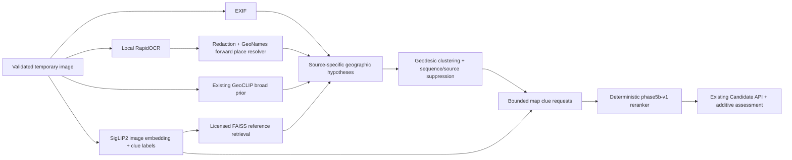

# Phase 5B accuracy-recovery plan

Status: architecture/contract and fixed baseline frozen; implementation seams are
integrated, but Phase 5B is blocked on real OCR/SigLIP2/forward-gazetteer/10k-index
installation and the combined improvement run. Phase 6 is not authorized.

## Reproduced failure

The installed CUDA GeoCLIP path still returns five valid WGS84 hypotheses, but the
authorized smoke image is not five independent hypotheses. The 25 km diversity
pass retained two of twenty upstream rows and the availability repair backfilled
three rows at the one-metre distinctness floor. Six of ten final pairs were within
25 km; all five were within 100 km; the pairwise median was 0.384 km. Every public
candidate was `model_only`, had provider diversity one, no retrieval/map/place
support, and the same 750 km radius. This establishes the frozen baseline defect;
it does not invalidate the GeoCLIP normalizer.

## Frozen evidence architecture

Raw OCR text exists only in memory between OCR and place resolution. Reference
images stay in the private operator dataset root; SQL and public responses contain
opaque keys and licensed metadata, never absolute paths or blobs. A missing
optional provider is neutral and visible. EXIF retains priority. GeoCLIP gallery
softmax remains an uncalibrated relative input, never a probability.

Source candidates remain separate until geographic clustering. One provider,
sequence, capture family, content hash, or uploader cannot manufacture independent
support by returning many rows. GeoCLIP backfill rows in the same cluster count as
one provider contribution. Place ambiguity produces several weak hypotheses or no
hypothesis. Retrieval similarity and map observations are relative evidence, not
proof of a location.

## Frozen provider and data decisions

- OCR: `rapidocr-ppocrv6-local`, RapidOCR 3.9.1, pinned hashed artifacts,
  ONNX Runtime GPU 1.27.0 with verified CPU fallback. Runtime downloads are
  forbidden. Default PP-OCRv6 covers Latin/Turkish and CJK; additional Arabic,
  Cyrillic and Korean profiles require separately receipted explicit installation.
- Embedding/clues: `google/siglip2-base-patch16-384` at immutable revision
  `f775b65a79762255128c981547af89addcfe0f88`, 768 dimensions, normalized float32,
  identical query/reference preprocessing, local-only inference after install.
  The existing pinned CLIP ViT-L/14 is a separately named compatibility fallback,
  not a silent substitute for a SigLIP2 index.
- Gazetteer: a versioned additive GeoNames forward-search artifact with canonical
  and alternate names, language/script, feature type, country/admin fields,
  coordinates, population and FTS/prefix indexes. The existing reverse resolver
  contract remains valid.
- Initial reference sources: operator-approved KartaView and individually reviewed
  Wikimedia Commons only. KartaView remains blocked until the operator accepts the
  current terms/share-alike treatment. Commons has no corpus-wide license; every
  record must pass an explicit CC0 1.0 or CC BY/CC BY-SA 2.0-4.0 allowlist,
  attribution, restriction and coordinate-provenance review. The exact per-file
  license/version is retained. Mapillary and OSV-5M remain out.
- Initial index gate: at least 10,000 accepted records after validation and
  exact/near-duplicate rejection, six inhabited continents and at least 30
  countries. Acquisition is metadata-review first and never silent. Evaluation
  assets, hashes and capture families are excluded from the reference index.
- Map renderer: MapLibre remains default. Development default is the labeled
  OpenFreeMap Liberty style with visible OpenStreetMap attribution and an explicit
  availability warning; production must select an approved provider or self-hosted
  PMTiles/vector style. Public OSM raster tiles are not a production bulk backend.
  Optional Google mode is disabled without an operator key and uses only the
  official Maps JavaScript API; Google imagery never enters retrieval/training.
- Map evidence: local GeoNames is always available after its explicit install.
  OSM feature verification reuses the bounded cache/rate/circuit-breaker Overpass
  adapter only when the operator configures a contact-bearing User-Agent and
  enables network research. Absence in OSM is neutral. No uncontrolled scraping.

## Frozen additive API changes

Existing endpoints, multipart fields, candidate fields and GeoCLIP diagnostics
remain unchanged. The only public additions are optional:

- `Candidate.phase5b_assessment`: `phase5b-v1` relative score semantics, raw
  feature/weight/contribution rows, provider/source diversity, safe OCR-place
  matches, opaque retrieval matches with license/attribution/display policy, map
  observations, supports, contradictions, limitations and movement reasons.
- `Analysis.phase5b_diagnostics`: provider outcome/status rows, reference-index
  identity/count/dimension and unavailable/partial-failure codes. No local paths,
  raw OCR, secret-bearing URLs or truth coordinates.
- provider capabilities may add provider type, offline state, declared license,
  model/index revision and safe limitation fields.

All additions are nullable/optional so stored Phase 1-5 records and existing clients
remain valid. Generated TypeScript and Zod validators must be regenerated together.

## phase5b-v1 deterministic policy

Candidate features may include GeoCLIP rank/raw score/dispersion, OCR place match
and ambiguity, script consistency, retrieval similarity/cluster size/source and
capture-family diversity/compactness, SigLIP2 observable clue compatibility, map
support, quality and contradictions. Missing features contribute zero. Stable IDs
break ties. No feature is converted to probability.

Broad model-only hypotheses retain at least a 750 km radius. A radius may narrow
only from measured cluster dispersion and independent place/retrieval support,
subject to explicit floors. The initial map fits candidate centers, renders markers
first, and shows uncertainty only when selected or toggled. Broad hypotheses use a
low-opacity heatmap/contour representation rather than five opaque circles.

## Gate 0 and improvement gate

Before scoring Phase 5B, freeze at least 30 reviewed operator-owned or licensed
images (100 preferred), with immutable manifest fingerprint, hashes, perceptual
hashes, capture families, geography and scene categories. The set must include
multiple continents/countries and urban, rural, road, landmark, natural,
text-rich/text-poor, low-resolution and difficult-viewpoint examples. It cannot be
changed after the baseline is observed.

Run unchanged GeoCLIP-only and full/ablation configurations against that exact
fingerprint. Complete status requires country Top-1 degradation no worse than five
percentage points; plus country Top-1 +10 points, median error -20%, or Recall@200
+10 points; plus improvement on both text-rich and landmark subsets. A smaller or
biased set is explicitly preliminary. Failure remains a Phase 5B failure, not a
reason to alter the test slice.

Gate 0 was frozen before behavior implementation with manifest fingerprint
`9767b0ec500c0b7972aa0f26fdfb0d48560b908285c7c34cf23b18ae32b5fba9`:
30 individually licensed Commons derivatives, 24 countries and all six inhabited
continents. Visual QA fixed scene labels before inference; the slice contains nine
text-rich cases, five landmark cases, wildlife, interiors, road/transit, urban,
rural/natural, low-resolution and difficult-viewpoint cases. Exact hashes,
perceptual hashes and capture families are unique. Reference-index overlap is
forbidden.

The unchanged labeled GeoCLIP baseline returned 30/30 candidates. Country Top-1
was 19/28 (67.86%) and Top-5 21/28 (75.00%); two predictions had no GeoNames label
within the resolver radius and remain explicit exclusions. Recall@1/25/200/750/2500
km was 6/10/17/22/26 of 30 (20.00/33.33/56.67/73.33/86.67%). Median and mean
Top-1 error were 143.140 km and 1441.540 km. The text-rich subset baseline was
country 6/9, Recall@200 4/9 and median 277.634 km. The landmark subset was country
4/5, Recall@200 4/5 and median 0.959 km. These are preliminary fixed-slice
measurements, not global performance claims.

## Implementation ownership

- Agent E: OCR worker/provider, redaction, script/language hints, GeoNames forward
  place resolution and safe OCR-to-place pipeline tests.
- Agent F: SigLIP2 model management/provider, licensed dataset acquisition and
  validation, metadata migration, FAISS construction/query and upload retrieval.
- Agent G: source-candidate clustering, `phase5b-v1` reranker/map constraints,
  additive assessment adapter, MapLibre/UX and bilingual tests.
- Main agent: shared Pydantic/OpenAPI contracts, config/dependencies, conflict
  resolution, explicit model/data approval, integration, fixed benchmark,
  ablations, final verification, documentation and project state.

## Implemented versus blocked snapshot

Implemented and locally verified: RapidOCR worker/provider/redaction and receipted
wheel-model staging; GeoNames forward installer/resolver; pinned SigLIP2 provider
and model manager; Commons metadata-review/acquisition validation; FAISS upload
query adapter; source adapters; `phase5b-v1`; additive API/repository migration;
bounded pinned-IP Overpass transport; MapLibre/OpenFreeMap UI; fixed comparison
reporting. A fixture-backed normal-upload test proves OCR, retrieval and map
evidence can move a candidate ahead of the GeoCLIP prior without raw OCR/path
leakage. That test is not an accuracy result.

Blocked on the target: RapidOCR/ONNX dependencies and real CUDA/CPU run, forward
GeoNames v2 bytes, SigLIP2 snapshot and real embedding tests, reviewed Commons
10,000-image acquisition/index, real upload retrieval, enabled Overpass run,
five-mode ablations and combined fixed-set metrics. The session's external
download/approval limit rejected further installs; no alternate download path was
used. See `phase-5b-benchmark-comparison.md`.

## Stop conditions

No Phase 6 identity, distributed queue/index, autoscaling, SLO, release or fleet
work is authorized. No completion claim is allowed with a disabled mandatory
provider, a fixture-only index, fewer than the accepted index/evaluation gates, or
without the measured improvement calculation.
