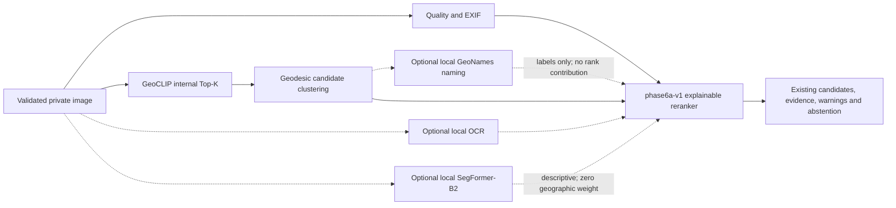

# Phase 6A hybrid geolocation evidence pipeline

Phase 6A extends the existing upload analysis. It does not replace the GeoCLIP
provider, Phase 5B seams, API routes, persistence model, or frontend design.
GeoCLIP remains the geographic candidate generator; SegFormer-B2 describes image
content and never predicts a country, city, or coordinate.

## Responsibility boundaries



- GeoCLIP requests `GEOCLIP_INTERNAL_TOP_K=50` by default. The public candidate
  list remains bounded to five for compatibility. Raw gallery similarity and
  cluster support are uncalibrated ordering features, not probabilities.
- Clustering uses geodesic distance, a configurable 40 km default, spherical
  centroids, stable ties, and longitude-wrap/pole-safe helpers. It retains raw
  member ranks for diagnostics.
- Reverse geocoding resolves only the configured top clusters through the
  existing local GeoNames artifact. Its normalized-coordinate SQLite cache stores
  positive and negative results with bounded TTLs. Missing labels do not remove
  coordinates or change rank.
- Real OCR public-place matches may support or contradict a cluster. Weak OCR is
  ignored. Only the explicit `ja`, `ko`, and `zh` language mappings currently
  contribute country consistency; generic script guesses remain neutral.
- Segmentation contributes structured scene description and provider completeness
  only. `phase6a-v1` assigns it no geographic score. Scene rules are enabled only
  with an exact reviewed label mapping.
- Candidate `confidence_assessment.score` is always `null` and `calibrated` is
  always `false`. `low`, `medium`, `high`, and `very_high` are deterministic
  evidence-quality labels, not measured correctness probabilities.

## Inspected checkpoint and prepared artifact

The trusted repository-local checkpoint inspected for this phase has these facts:

| Field | Value |
|---|---|
| Source | `last_checkpoint.pt` (Git-ignored; never delete or commit it) |
| Size | `439721578` bytes |
| SHA-256 | `1b41ad916a10998722c346bd466c48bd8d40a5f4c8d032f6db6622f692f0855b` |
| Epoch / best mIoU / patience | `12` / `0.24783799030684367` / `0` |
| Base model | `nvidia/segformer-b2-finetuned-cityscapes-1024-1024` |
| Training image size | `640` |
| Student / EMA state dictionaries | `380` tensors each |
| Inferred classifier outputs | `124` |
| Selected deployment weights | `ema` |
| State-dict adapter | `transformers_modular_segformer_to_legacy_v1` |

The preparation path validates the exact target key set and every tensor shape,
then performs a strict load. It saves only a Hugging Face-compatible
safe-serialized deployment directory. Optimizer, scheduler, and scaler state do
not enter inference.

The current prepared directory is:

```text
.local/models/atlaslens-segformer-b2-v4
```

Phase 6A initially prepared 124 stable generic names. Phase 6B later restored the
reviewed exact 124-entry mapping from
`assets/mapillary/segformer_mapillary_config.json`. The current deployment has
`semantic_label_names_available=true`; dominant names, proportions and centralized
scene groups are real segmentation output. Relabeling did not load or change
weights, and none of these classes is geographic evidence.

## Exact Windows PowerShell setup

Run these commands from the repository root. The base-model download is a separate
explicit network and license-review action; API startup never performs it.

```powershell
Copy-Item .env.example .env
uv sync --project .\services\api --frozen --all-groups
npm.cmd --prefix .\apps\web ci

.\services\api\.venv\Scripts\python.exe .\scripts\inspect_segmentation_checkpoint.py .\last_checkpoint.pt
```

Stage only the three reviewed base-model files at the exact revision used by this
phase:

```powershell
@'
from huggingface_hub import snapshot_download

snapshot_download(
    repo_id="nvidia/segformer-b2-finetuned-cityscapes-1024-1024",
    revision="d633b2072669ca68d8f8e309de9b52bfdbf6bf72",
    local_dir=".local/models/base-segformer-b2-cityscapes",
    allow_patterns=["config.json", "preprocessor_config.json", "pytorch_model.bin"],
)
'@ | .\services\api\.venv\Scripts\python.exe -
```

Convert the trusted training checkpoint. Re-running the same command is
idempotent when the output receipt matches the checkpoint SHA-256.

```powershell
.\services\api\.venv\Scripts\python.exe .\scripts\prepare_segmentation_model.py `
  .\last_checkpoint.pt `
  --base-model-dir .\.local\models\base-segformer-b2-cityscapes `
  --output .\.local\models\atlaslens-segformer-b2-v4
```

Restore or verify the reviewed repository mapping on an already prepared safe
directory. The command strictly checks the architecture, 124-output classifier,
inverse IDs and existing safetensors digest:

```powershell
.\services\api\.venv\Scripts\python.exe .\scripts\restore_mapillary_labels.py `
  --model-dir .\.local\models\atlaslens-segformer-b2-v4
```

The command is idempotent. It updates only `config.json` and bounded deployment
metadata; `model.safetensors` retains SHA-256
`a364afc012b98cc494d1d95ac81b9db1d37e7fd09eaa021a23fcbea74fc16e8b`.

## Runtime configuration and startup

Set these values in the untracked `.env` after model preparation:

```text
PHASE6A_ENABLED=true
GLOBAL_MODEL_ENABLED=true
GEOCLIP_INTERNAL_TOP_K=50
GEOCLIP_CLUSTER_RADIUS_KM=40
SEGMENTATION_ENABLED=true
SEGMENTATION_CHECKPOINT=last_checkpoint.pt
SEGMENTATION_MODEL_DIR=.local/models/atlaslens-segformer-b2-v4
SEGMENTATION_DEVICE=auto
SEGMENTATION_MIN_CLASS_RATIO=0.001
SEGMENTATION_MAX_DOMINANT_CLASSES=12
SEGMENTATION_TIMEOUT_SECONDS=90
REVERSE_GEOCODE_TOP_K=10
REVERSE_GEOCODE_TIMEOUT_SECONDS=2
```

`auto` selects CUDA when available and otherwise CPU. SegFormer is lazy-loaded
once and serializes inference. The pipeline does not run GeoCLIP and SegFormer as
simultaneous GPU-heavy calls. If SegFormer is disabled, incomplete, or fails, the
GeoCLIP result may still complete with a provider warning.

The reverse-name SQLite cache is an optimization, not evidence. A lock or cache
read/write failure emits `provider.reverse_geocoding.cache_unavailable` and
continues with uncached local GeoNames resolution; coordinates and ranking remain
unchanged.

Start both surfaces (the script applies migrations):

```powershell
powershell -NoProfile -ExecutionPolicy Bypass -File .\scripts\dev.ps1
```

Or use two PowerShell terminals:

```powershell
powershell -NoProfile -ExecutionPolicy Bypass -File .\scripts\start-api.ps1
powershell -NoProfile -ExecutionPolicy Bypass -File .\scripts\start-web.ps1
```

The API is `http://127.0.0.1:8000`; the web client is
`http://127.0.0.1:5173`.

## Optional local naming, OCR, and licensed retrieval index

Reverse naming is available only after the existing offline GeoNames artifact is
installed. OCR remains optional and must pass its existing model/runtime checks:

```powershell
Set-Location .\services\api
.\.venv\Scripts\atlas.exe gazetteer --json install
.\.venv\Scripts\atlas.exe gazetteer --json verify
.\.venv\Scripts\atlas.exe gazetteer --json install-forward
.\.venv\Scripts\atlas.exe gazetteer --json verify-forward
.\.venv\Scripts\atlas.exe models install rapidocr
.\.venv\Scripts\atlas.exe models verify rapidocr
Set-Location ..\..
```

The base GeoNames artifact names candidate coordinates; the forward artifact
resolves sufficiently strong OCR place strings. Either provider may remain
unavailable and must not be represented as a successful lookup.

Phase 6A does not fabricate a DINOv2/FAISS system. The pre-existing Phase 3
licensed SigLIP2/FAISS workflow remains separate and requires an operator-owned
validated manifest and an installed verified embedding model:

```powershell
Set-Location .\services\api
.\.venv\Scripts\atlas.exe embeddings create --manifest C:\licensed\manifest.csv --input-root C:\licensed\images --index-dir C:\private\atlas-index --provider siglip2-b16-384 --device auto
.\.venv\Scripts\atlas.exe embeddings verify --index-dir C:\private\atlas-index
.\.venv\Scripts\atlas.exe embeddings info --index-dir C:\private\atlas-index
.\.venv\Scripts\atlas.exe retrieval smoke-test --index-dir C:\private\atlas-index --image C:\licensed\smoke.jpg --top-k 5 --device auto
Set-Location ..\..
```

No dataset downloader is part of this workflow. Retrieval hits remain licensed
reference evidence and are not automatically correct locations.

## API and frontend behavior

The existing endpoints and candidate fields remain valid. Phase 6A only adds
optional fields:

- `Analysis.scene_analysis`: provider/device/timing, dominant class IDs and pixel
  ratios, reviewed semantic groups/tags when labels permit, and safe warnings.
- `Candidate.geoclip_cluster`: member count/ranks, raw similarity summaries and
  uncalibrated cluster support.
- `Candidate.reverse_geocode`: an offline place label and its source/version/license;
  it is ranking-neutral.
- `Candidate.confidence_assessment`: qualitative label, `score=null`,
  `calibrated=false`, and an explicit basis.
- `Candidate.phase5b_assessment.reranker_version=phase6a-v1`: transparent raw
  features, weights, contributions, contradictions, movement, and limitations.

The frontend renders these fields when present and continues to handle older
responses where they are absent. Generic segmentation labels suppress semantic
group/tag presentation. No mask array, image blob, raw OCR payload, checkpoint
path, or exception trace is returned.

## Verification commands

```powershell
powershell -NoProfile -ExecutionPolicy Bypass -File .\scripts\validate-contract.ps1

Set-Location .\services\api
.\.venv\Scripts\ruff.exe check .
.\.venv\Scripts\mypy.exe src
.\.venv\Scripts\pytest.exe
Set-Location ..\..\apps\web
npm.cmd run lint
npm.cmd run typecheck
npm.cmd test
npm.cmd run check:api
npm.cmd run build
Set-Location ..\..
```

Unit fixtures prove deterministic behavior, not real-world geolocation accuracy.
A completion claim also requires the recorded real checkpoint/model/image smoke
gate in `PROJECT_STATE.md`.

## Honest limitations and preserved Phase 6A boundary

- Exact class names describe pixels but are neither geographic coordinates nor a
  country/city style classifier.
- Segmentation has no geographic reference database and must not affect location
  rank from road, building, vegetation, or other scene proportions.
- OCR, GeoNames reverse naming, and the licensed retrieval index can be unavailable.
- GeoCLIP, cluster support, reranker output, and qualitative confidence labels are
  uncalibrated. No accuracy, coverage, latency, or probability claim follows.
- Reverse geocoding names an existing coordinate; it never creates or strengthens
  one.
- The original Phase 6A work included no DINOv2 retrieval, new FAISS corpus,
  confidence calibration, production load benchmark or distributed GPU worker.
  The later bounded Phase 6B extension is documented separately in
  `phase-6b-multimodel.md` and does not change these responsibilities.

The next bounded phase is Phase 6B only after a separately approved scope. It may
address labelled calibration/evaluation, reviewed reference-data comparisons, and
production worker isolation; it must not be inferred from Phase 6A output.
